```yaml
title: Test 2
description: Graphs Hash Tables and More
slug: Exam_02
id: 06-T02
name: 06-T02
category: exam
date_assigned: 2026-04-16 12:00
date_due: 2026-04-16 15:30
resources: []
```

# Containers, Algorithms, and Policies — Study Guide

> Why Your Code Breaks: Containers, Algorithms, and Lies

<!-- > "When an algorithm is slow, it's usually not the algorithm.
> It's the mismatch between assumptions and guarantees." -->

---

## The Core Framework

Every performance question in this course reduces to three things:

```
Container  →  What is guaranteed
Algorithm  →  What is assumed
Policy     →  How an operation actually behaves

Performance  =  Interaction of all three
```

If any of those three are misaligned, the system breaks — sometimes silently.

---

## Section 1 — What Does a Container Guarantee?

A container does not just "hold data." It makes **binding promises** about:

- how data is stored
- how it can be accessed
- what costs are predictable

| Container       | Key Guarantees                                   |
| --------------- | ------------------------------------------------ |
| Stack           | LIFO order; O(1) push and pop                    |
| Queue           | FIFO order; O(1) enqueue and dequeue             |
| Vector / Array  | O(1) random access by index                      |
| Linked List     | O(1) insert/delete given a node pointer          |
| BST             | Ordered traversal; O(log n) if balanced          |
| AVL / Red-Black | Height bounded to O(log n) always                |
| Heap            | O(1) access to min or max                        |
| Hash Table      | O(1) average lookup (requires good distribution) |
| Trie            | Prefix-based lookup; O(k) per operation          |

**What to ask yourself:** What does this container promise — and under what conditions does that promise break?

---

## Section 2 — What Does an Algorithm Assume?

Algorithms are not self-contained. Every algorithm quietly depends on the container it runs on.

| Algorithm      | What It Assumes                                  |
| -------------- | ------------------------------------------------ |
| Binary Search  | Sorted data + O(1) random access by index        |
| Heap Insert    | Heap property is currently maintained            |
| BFS            | FIFO ordering (queue)                            |
| DFS            | LIFO ordering (stack)                            |
| Hash Lookup    | Good hash distribution, few collisions           |
| Trie Search    | Characters exist as individual nodes in the path |
| Tree Traversal | Tree structure is valid and reachable from root  |

**The dangerous assumption:** Many algorithms assume their input container provides something it doesn't. That assumption is never written in the algorithm itself — you have to know to look for it.

---

## Section 3 — Same Algorithm, Different Container = Different Reality

The algorithm's name does not tell you its cost. The container does.

### Binary Search

| Container   | Cost     | Why                                    |
| ----------- | -------- | -------------------------------------- |
| Array       | O(log n) | O(1) random access makes `mid` instant |
| Linked List | O(n)     | Accessing `mid` requires traversal     |

> You want to say O(n lg n) for Linked List. Why?
> $\frac{n}{2} + \frac{n}{4} + \frac{n}{8} + \cdots$

### Insert into Sorted Structure

| Container   | Cost     | Why                                      |
| ----------- | -------- | ---------------------------------------- |
| Array       | O(n)     | Shift elements to make room              |
| Linked List | O(n)     | Traverse to find position                |
| BST         | O(log n) | If balanced — follow comparisons to leaf |

### Priority Queue Implementations

| Container     | Insert   | Remove-Max |
| ------------- | -------- | ---------- |
| Binary Heap   | O(log n) | O(log n)   |
| Sorted List   | O(n)     | O(1)       |
| Unsorted List | O(1)     | O(n)       |

The right choice depends on your workload.

- **Heavy inserts**? Unsorted list may win.
- **Heavy removals**? You need the heap.

---

## Section 4 — Are Insert / Delete / Search Policies?, Or Operations?

The words insert, delete, and search describe **families of behavior**, not a single defined action.

### Insert ~~Policies~~ Operations

| Container  | What "insert" actually means                            |
| ---------- | ------------------------------------------------------- |
| Stack      | Push to top                                             |
| Queue      | Enqueue at rear                                         |
| BST        | Walk comparisons to find position; place leaf           |
| Heap       | Append to end; bubble up to restore heap property       |
| Hash Table | Hash the key; handle collision; store at computed index |
| Trie       | Walk character by character; create nodes as needed     |

### Delete ~~Policies~~ Operations

| Container | What "delete" actually means                              |
| --------- | --------------------------------------------------------- |
| Stack     | Pop the top                                               |
| Queue     | Dequeue the front                                         |
| Heap      | Remove root; replace with last element; sift down         |
| BST       | Find node; handle 0/1/2 children; may restructure subtree |

### Search ~~Policies~~ Operations

| Method         | Mechanism                         | Requires                   |
| -------------- | --------------------------------- | -------------------------- |
| Linear scan    | Compare every element             | Nothing                    |
| Binary search  | Eliminate half at each step       | Sorted + O(1) index access |
| Hash lookup    | Compute index directly            | Good distribution          |
| Tree traversal | Follow comparisons                | Valid BST ordering         |
| Prefix match   | Walk nodes character by character | Trie structure             |

---

## Section 5 — Broken Systems (Study These)

These are examples of mismatches. For each one, identify: the goal, the mismatch, and the fix.

---

### Case 1: Binary Search on a Linked List

```python
# Student tries to binary search a sorted linked list
mid = traverse_to(list, len // 2)   # O(n) just to get mid
```

#### Goal:

- Fast lookup in sorted data.

#### Mismatch:

- Binary search assumes O(1) access to any index.
- A linked list only provides sequential access.
- Reaching `mid` requires traversal from the head.
- The traversal costs across all steps form a convergent series ($\frac{n}{2} + \frac{n}{4} + \frac{n}{8} + ...$) that totals **O(n)** — no faster than linear search, and far more complex.

#### Fix:

- Use an array/vector for binary search, or use a balanced BST.

---

### Case 2: Unsorted Priority Queue with Heavy Removals

```python
pq = []
# 100,000 remove-max operations
for _ in range(100_000):
    highest = max(pq)   # O(n) every time
    pq.remove(highest)
```

#### Goal:

- Priority queue with many extractions.

#### Mismatch:

- Unsorted list gives O(1) insert but O(n) remove-max.
- At 100k removals, this is O(n²) total.

#### Fix:

- Use a binary heap — O(log n) per removal.

---

### Case 3: Queue Implemented with List pop(0)

```python
q = []
q.append("A")
first = q.pop(0)   # shifts every remaining element
```

#### Goal:

- FIFO queue.

#### Mismatch:

- Python lists are arrays.
- Removing from index 0 requires shifting all remaining elements — O(n) per removal.

#### Fix:

- Use `collections.deque`, which supports O(1) front removal.

> Is this language specific?

---

### Case 4: BST Receiving Sorted Input

```python
for value in sorted_data:
    insert_bst(root, value)   # always inserts to the right
```

#### Goal :

- Balanced BST with O(log n) operations.

#### Mismatch :

- Sorted input makes every insert go to the same side. The tree degenerates into a linked list with O(n) height.

#### Fix :

- Use AVL or Red-Black tree, which enforce height balance regardless of input order.

---

### Case 5: Hash Table When Order Is Required

```python
table = {}
for word in words:
    table[word] = True
# User now wants alphabetical listing
print(sorted(table.keys()))   # has to sort anyway
```

#### Goal :

- Fast lookup AND ordered traversal.

#### Mismatch :

- Hash tables do not maintain sorted order. You get O(1) lookup but no ordering guarantee.

#### Fix :

- Use a balanced BST (AVL/Red-Black) which provides O(log n) lookup and in-order traversal for free, or a trie if prefix queries matter.

> Python sorted dict?
> Whats the trade offs?

---

### Case 6: Linear Uniqueness Check at Scale

```python
seen = []
for item in data_stream:   # 1,000,000 items
    if item not in seen:   # O(n) linear search each time
        seen.append(item)
```

#### Goal :

- Collect unique items.

#### Mismatch :

- `in` on a list is a linear scan. At 1M items, this becomes O(n²) total.

#### Fix :

- Use a `set` or hash table — membership check is O(1) average.

> Or a python dictionary (like a hash table)

---

### Case 7: Huffman Codes Stored in Unsorted List

```python
codes = [("e", "101"), ("t", "00"), ("a", "1110"), ...]
# Every encode call scans front to back
for ch in message:
    for sym, code in codes:   # O(k) per character
        if sym == ch: ...
```

#### Goal :

- Fast character-to-code lookup during encoding.

#### Mismatch :

- A Huffman tree produces the codes efficiently, but storing them in a list makes every lookup O(k) where k is alphabet size.

#### Fix :

- Load codes into a dictionary/hash table after building the tree. Encoding becomes O(1) per character.

#### Lesson:

- Even when the constructing algorithm is optimal, using the wrong companion container destroys the benefit.

---

### Case 8: Trie for Pure Exact-Match Lookup

```python
# Only operation ever performed:
trie.search("ID_48291")   # exact match, no prefix queries
```

#### Goal :

- Check if an exact ID exists.

#### Mismatch :

- Tries are built for prefix operations. If you never exploit prefix relationships, you pay the trie's memory overhead for nothing.

#### Fix :

- Use a hash table for O(1) average exact membership testing.

#### Lesson:

- Every structure is the right choice for some workload. Choose based on what operations actually dominate.

---

## Section 6 — Algorithm-Container Compatibility

Not every algorithm works on every container. This table is the mental lens for the rest of the course.

| Container      | Algorithm         | Works? | Why / Why Not                                            |
| -------------- | ----------------- | ------ | -------------------------------------------------------- |
| Array          | Binary Search     | Yes    | O(1) random access satisfies the algorithm's assumption  |
| Linked List    | Binary Search     | No     | No indexing — reaching `mid` costs O(n)                  |
| Tree           | DFS               | Yes    | Hierarchical structure matches recursive descent         |
| Graph          | Inorder Traversal | No     | No guaranteed left/right child — structure doesn't exist |
| BST            | Inorder Traversal | Yes    | Ordering invariant guarantees sorted output              |
| Unsorted array | Binary Search     | No     | Sorted precondition violated — correctness breaks        |

**The key question for any algorithm-container pairing:** Does the container provide what the algorithm assumes?

---

## Section 7 — Traversal Intent

Students tend to memorize traversal names, but the exam asks _why_ you chose one over another.

| Goal                       | Traversal          | Why                                                    |
| -------------------------- | ------------------ | ------------------------------------------------------ |
| Sorted output              | Inorder (BST only) | Left-root-right respects BST ordering invariant        |
| Shortest path (unweighted) | BFS                | Explores level by level — first path found is shortest |
| Cycle detection            | DFS                | Back edges only visible via depth-first traversal      |
| Safe tree deletion         | Postorder          | Children freed before parent — no dangling pointers    |
| Level-by-level processing  | BFS                | Queue naturally processes one level before the next    |
| Reachability               | Either DFS or BFS  | Both visit all reachable nodes                         |

**DFS vs BFS in one line:** DFS uses a stack (LIFO) and goes deep. BFS uses a queue (FIFO) and goes wide.

---

## Section 8 — Recursion: Feature or Liability?

Recursion is neither elegant magic nor forbidden syntax. It is a tool with a clear rule:

> **If the data structure is recursive, the algorithm probably should be too.**

| Situation                      | Recursion appropriate? | Why                                                        |
| ------------------------------ | ---------------------- | ---------------------------------------------------------- |
| Tree traversal                 | Yes                    | Trees are defined recursively — code mirrors structure     |
| Graph traversal (large graphs) | Caution                | Deep graphs can overflow the call stack                    |
| Binary search                  | Either                 | Both iterative and recursive are correct                   |
| DFS                            | Either                 | Recursive DFS = implicit stack; iterative = explicit stack |

#### Practical rule:

- If the recursive depth could exceed a few thousand, use an explicit stack instead.

#### Tree vs Graph distinction:

- Trees cannot have cycles, so recursive tree traversal needs no visited set. Graphs can cycle, so DFS on a graph _must_ track visited nodes or it will loop forever.

> "Trees don't need cycle detection because they promised not to lie."

---

## Section 9 — Question Patterns to Expect

These are the types of reasoning the exam will require:

**Guarantee identification:**

- What does this container guarantee that makes this algorithm valid?
- Which guarantee is missing, causing this approach to fail?

**Assumption identification:**

- What does this algorithm quietly assume but never state?
- What assumption fails when the container is swapped?

**Mismatch diagnosis:**

- Why does the same operation name produce different behavior here?
- Which hidden cost dominates this scenario?

>

**Policy definition:**

- Define the insert policy for [container].
- Why is "search" too vague to analyze without knowing the container?

**Repair reasoning:**

- What would you replace — the container, the algorithm, or the policy?
- What mismatch are you correcting, and how?

**Call the bluff:**

- A student claims "insert is O(1)." Why is this incomplete?
- A student claims "I used the same search on every container, so the comparison is fair." What's wrong with that?

**What breaks if...**

- What breaks if a **heap is not a complete binary tree**? (The array-index parent/child math no longer holds.)
- What breaks if you run **BFS with a stack** instead of a queue? (LIFO ordering — you get DFS behavior, not level-by-level.)
- What breaks if you run **DFS on a graph without a visited set**? (Infinite loop on any cycle.)
- What breaks if a **BST receives sorted input**? (Degenerates to a linked list — all operations become O(n).)
- What breaks if you apply **inorder traversal to a general graph**? (No left/right child concept exists — the traversal has no meaning.)

**Spot the lie — these are all false:**

- _"Heapify is O(n log n)."_ — False. Heapify (build-heap from an array) is **O(n)**. The naive analysis overcounts because most nodes are near the bottom and travel very few levels.
- _"Inorder traversal always produces sorted output."_ — False. Only for a **BST**. On a general binary tree with no ordering invariant, inorder output is arbitrary.
- _"DFS always uses recursion."_ — False. DFS can be implemented iteratively with an **explicit stack**. The recursive version just uses the call stack implicitly.

**Choose the container:**
For each scenario, name the container, algorithm, and one-sentence justification:

- You must repeatedly remove the highest-priority item from a dynamic dataset.
- You need fast exact lookup with no ordering requirement.
- You need fast lookup and in-order traversal of all keys.
- You need to find all strings sharing a common prefix.

---

## Section 10 — AVL and Red-Black Tree Rotations

Both AVL and Red-Black trees are self-balancing BSTs. They differ in _what invariant they enforce_ and _how aggressively they restore it_.

| Property          | AVL Tree                        | Red-Black Tree                                                |
| ----------------- | ------------------------------- | ------------------------------------------------------------- |
| Balance criterion | Every node: \|bf\| ≤ 1          | No two consecutive red nodes; equal black-height on all paths |
| Height guarantee  | ≤ 1.44 log n (stricter)         | ≤ 2 log n (looser)                                            |
| Rebalancing cost  | More rotations on insert/delete | Fewer rotations; recoloring is cheap                          |
| Lookup speed      | Slightly faster (shorter tree)  | Slightly slower                                               |

---

### AVL Trees: Balance Factor and When to Rotate

The **balance factor** of a node = height(left subtree) − height(right subtree).

A valid AVL node has bf ∈ {−1, 0, 1}. Any value outside that range triggers a rotation.

**Computing heights:** A null child has height −1 (or 0 depending on convention). A leaf has height 0. Always compute bottom-up.

```
    10  ← bf = 0 − 2 = −2  (violated)
      \
      20  ← bf = 0 − 1 = −1
        \
        30  ← bf = 0
```

---

### AVL Single Rotation — Right-Right Case

**When:** The imbalanced node is right-heavy (bf = −2) **and** its right child is also right-heavy (bf = −1 or 0).

**Fix:** Single **left rotation** at the imbalanced node.

```
Before:          After left rotation at 10:

  10 (bf=−2)            20
    \                  /  \
    20 (bf=−1)       10    30
      \
      30
```

The right child (20) rises; the imbalanced node (10) drops to become 20's left child. The right child's left subtree (none here) transfers to become 10's right child.

**Symmetric case:** Left-heavy node (bf = +2) with left-heavy left child (bf = +1) → single **right rotation** at the imbalanced node.

---

### AVL Double Rotation — Right-Left Case

**When:** The imbalanced node is right-heavy (bf = −2) **but** its right child is _left-heavy_ (bf = +1). The path makes a zig-zag shape.

**Why a single rotation fails:** Promoting the right child directly puts the zig-zag child in the wrong subtree, violating BST order.

**Fix:** Two rotations.

1. **Right rotate** at the right child (straightens the zig-zag).
2. **Left rotate** at the imbalanced node (lifts the middle value).

```
Before:          After right-rotate at 30:    After left-rotate at 10:

  10 (bf=−2)          10                           20
    \                   \                          /  \
    30 (bf=+1)          20                       10    30
    /                     \
   20                      30
```

**Symmetric case:** Left-heavy node (bf = +2) with right-heavy left child (bf = −1) → **Left-Right case**: left rotate at left child, then right rotate at imbalanced node.

| Imbalance   | Child direction | Fix                                  |
| ----------- | --------------- | ------------------------------------ |
| Right-Right | bf child = −1   | Single left rotation                 |
| Right-Left  | bf child = +1   | Right rotate child, left rotate node |
| Left-Left   | bf child = +1   | Single right rotation                |
| Left-Right  | bf child = −1   | Left rotate child, right rotate node |

---

### Red-Black Trees: The Five Properties

A valid Red-Black tree satisfies all five simultaneously:

1. Every node is red or black.
2. The root is black.
3. Every null leaf is black.
4. A red node's children are both black (no two consecutive red nodes).
5. Every path from a node to any descendant null leaf has the same number of black nodes (**black-height**).

**When you insert**, the new node is always colored **red** first. This can violate Property 4 if the parent is also red. The fix depends on the **uncle's color**.

---

### Red-Black Fix: Uncle is Red → Recolor

**Scenario:** New node's parent is red, and the uncle (parent's sibling) is also red.

**Fix:** No rotation needed. Recolor:

- Parent → black
- Uncle → black
- Grandparent → red

Then treat the grandparent as the new violation point and check upward. If the grandparent is the root, recolor it back to black (Property 2).

```
Before (insert 5):            After recolor:

     20 (B)                       20 (B)  ← was red; root → stays black
    /      \                     /      \
  10 (R)  30 (R)               10 (B)  30 (B)
  /                             /
 5 (R) ← violation            5 (R)
```

**Why this works:** Flipping parent and uncle to black keeps the black-height equal on both sides. Flipping grandparent to red passes the potential violation upward rather than down.

---

### Red-Black Fix: Uncle is Black → Rotate + Recolor

**Scenario:** New node's parent is red, but the uncle is black (or null).

Recoloring alone cannot fix this: making the parent black would reduce the black-height on that path, breaking Property 5. A rotation is needed to restructure first.

There are four sub-cases, matching AVL's four patterns:

**Left-Left (parent is left child, new node is left child):**

- Right rotate at grandparent.
- Swap colors of grandparent and parent.

```
Before (insert 10):           After right-rotate at 30 + recolor:

     30 (B)                        20 (B)
    /                             /      \
  20 (R)                       10 (R)   30 (R)
  /
10 (R) ← violation
```

**Right-Right:** Mirror image — left rotate at grandparent, swap colors.

**Left-Right (parent is left child, new node is right child):**

- Left rotate at parent (straightens zig-zag into Left-Left).
- Then apply Left-Left fix.

**Right-Left:** Mirror image of Left-Right.

---

### Rotation vs. Recolor: The Decision Rule

```
New node inserted (colored red). Parent is red → violation.

Is the uncle red?
  YES → Recolor parent + uncle → black; grandparent → red.
        Check grandparent as new violation point.
  NO  → Rotate (1 or 2 rotations depending on zig-zag shape).
        Recolor the new subtree root → black, its children → red.
        Done — no upward propagation needed.
```

---

### Side-by-Side: AVL vs. Red-Black Rotation Triggers

| Situation                    | AVL response | Red-Black response                        |
| ---------------------------- | ------------ | ----------------------------------------- |
| Straight imbalance (LL / RR) | 1 rotation   | 1 rotation + recolor (if uncle is black)  |
| Zig-zag imbalance (LR / RL)  | 2 rotations  | 2 rotations + recolor (if uncle is black) |
| Uncle is red (RB only)       | N/A          | Recolor only, no rotation                 |
| No violation                 | Nothing      | Nothing                                   |

---

### What to Ask Yourself on a Rotation Question

1. **Which node is out of balance?** (AVL: find bf = ±2. RB: find the red-red pair.)
2. **What direction is the imbalance?** (Left-heavy or right-heavy?)
3. **What does the child look like?** (Same direction → single rotation. Opposite → double rotation.)
4. **For RB only: what color is the uncle?** (Red → recolor. Black/null → rotate.)
5. **After fixing: verify.** (AVL: all bf ∈ {−1,0,1}. RB: all five properties hold.)

---

## Section 11 — Minimum Spanning Trees: Prim's and Kruskal's

A **Minimum Spanning Tree (MST)** of a connected, undirected, weighted graph is a subset of edges that connects all |V| vertices with no cycles and minimum total edge weight. Every MST has exactly |V| − 1 edges. If all edge weights are distinct, the MST is unique.

---

### The Cut Property — Why Greedy Works

A **cut** splits the vertex set into two non-empty groups S and V − S. Any edge with one endpoint in each group is a **crossing edge**.

> **Cut property:** For any cut, the minimum-weight crossing edge belongs to every MST.

This is why both algorithms are correct: every edge they select is the minimum crossing edge for some cut, which guarantees it belongs to the MST. Neither algorithm ever needs to backtrack.

---

### Prim's Algorithm

**Core idea:** Grow one connected tree from a starting vertex. At each step, extend the tree by the minimum-weight edge crossing the frontier between the current tree and the unvisited vertices.

**Data structure:** Min-priority queue of candidate vertices, keyed by the minimum known edge weight connecting each to the current tree. Two operations drive each step:

- **extract-min** — select the cheapest frontier vertex
- **decrease-key** — update a neighbor's key when a shorter connection is found

```
initialize: key[start] = 0,  key[all others] = ∞
PQ ← all vertices keyed by key[]
while PQ is not empty:
    u ← extract-min(PQ)
    add edge (parent[u], u) to MST
    for each neighbor v of u not yet in MST:
        if weight(u, v) < key[v]:
            key[v] = weight(u, v)    ← decrease-key
            parent[v] = u
```

**Complexity:** O((V + E) log V) with a binary heap.

---

### Kruskal's Algorithm

**Core idea:** Globally sort all edges by weight. Add each edge to the MST if its two endpoints are in different components (i.e., it does not close a cycle).

**Data structure:** Sort edges once — O(E log E) — then use **Union-Find** (Disjoint Set Union) for cycle detection. `find(u)` returns the component ID of u; `union(u, v)` merges two components. Both operations are effectively O(1) amortized.

```
sort all edges by weight
initialize: each vertex is its own component
for each edge (u, v, w) in sorted order:
    if find(u) ≠ find(v):      ← different components → no cycle
        add edge to MST
        union(u, v)
    (else skip — would close a cycle)
```

**Complexity:** O(E log E) = O(E log V), dominated by sorting.

---

### Worked Example

**Graph edges:** A–C (1), B–C (2), C–D (3), A–B (4), B–D (5), D–E (6)

**Kruskal's trace — process edges in sorted order:**

| Step | Edge | Weight | Action                           | Components after  |
| ---- | ---- | ------ | -------------------------------- | ----------------- |
| 1    | A–C  | 1      | Add                              | {A,C} {B} {D} {E} |
| 2    | B–C  | 2      | Add                              | {A,B,C} {D} {E}   |
| 3    | C–D  | 3      | Add                              | {A,B,C,D} {E}     |
| 4    | A–B  | 4      | Skip — A and B already connected | {A,B,C,D} {E}     |
| 5    | B–D  | 5      | Skip — B and D already connected | {A,B,C,D} {E}     |
| 6    | D–E  | 6      | Add                              | {A,B,C,D,E}       |

MST: A–C, B–C, C–D, D–E → total weight **12**

**Prim's trace — start at vertex A:**

| Step | Tree      | Frontier (edge : weight) | Chosen  |
| ---- | --------- | ------------------------ | ------- |
| 0    | {A}       | A–B:4, A–C:1             | A–C (1) |
| 1    | {A,C}     | A–B:4, B–C:2, C–D:3      | B–C (2) |
| 2    | {A,C,B}   | A–B:4†, C–D:3, B–D:5     | C–D (3) |
| 3    | {A,C,B,D} | A–B:4†, B–D:5†, D–E:6    | D–E (6) |

† Stale — both endpoints already in the tree.

MST: A–C, B–C, C–D, D–E → total weight **12**

---

### Key Differences

| Feature                 | Prim's                                          | Kruskal's                                   |
| ----------------------- | ----------------------------------------------- | ------------------------------------------- |
| What grows              | One connected tree from a root                  | Forest of components that merge             |
| Edge selection          | Min crossing edge (tree ↔ unvisited)            | Min global edge that doesn't close a cycle  |
| Core data structure     | Min-priority queue (extract-min + decrease-key) | Sorted edge list + Union-Find               |
| Cycle avoidance         | Implicit — only frontier edges are eligible     | Explicit — `find(u) ≠ find(v)` check        |
| Dense graphs (E >> V)   | Better — fewer PQ updates per vertex            | Worse — sort still costs O(E log E)         |
| Sparse graphs (E ≈ V)   | Comparable                                      | Better — sort is cheap, UF is fast          |
| Disconnected graphs     | Fails — stays in one component                  | Succeeds — produces minimum spanning forest |
| Needs a starting vertex | Yes                                             | No                                          |
| Complexity              | O((V+E) log V)                                  | O(E log E)                                  |

---

### Identifying an Algorithm from a Trace

**Signs you are looking at Kruskal's:**

- Edges appear in globally non-decreasing weight order — the global minimum is always first.
- Early steps may connect vertices in unrelated parts of the graph.
- A "skip" appears when `find(u) == find(v)` — both endpoints share a component.

**Signs you are looking at Prim's:**

- A single connected component grows from one starting vertex — the tree is always connected.
- Edges are not necessarily in globally sorted order; they reflect the cheapest link to the current frontier.
- Each step adds exactly one new vertex adjacent to the current tree.
- Stale edges appear on the frontier (both endpoints eventually in the tree).

**The sharpest distinguishing signal:** If the first edge added is not the globally minimum edge, it cannot be Kruskal's. It must be Prim's, starting from a vertex where the lighter edges are not incident.

---

### What to Ask Yourself on an MST Question

1. **Is the MST unique?** All edge weights distinct → yes, and both algorithms must agree.
2. **Are edges selected in globally sorted order?** Yes → Kruskal's. No → Prim's.
3. **Does the tree grow from one vertex outward?** Yes → Prim's.
4. **What detects the cycle?** Prim's: frontier only contains unvisited vertices. Kruskal's: `find(u) == find(v)`.
5. **Why is an edge skipped?** Prim's: the far endpoint is already in the tree. Kruskal's: both endpoints share a component root in Union-Find.

---

## Section 12 — Hash Tables

A **hash table** maps keys to array indices using a **hash function** h(k), aiming for O(1) expected lookup, insert, and delete. Two decisions dominate design: which hash function to use and how to resolve collisions.

---

### What Makes a Good Hash Function

| Property             | What it means                                                                           |
| -------------------- | --------------------------------------------------------------------------------------- |
| **Uniformity**       | Each output slot equally likely for a random key — no slot is a "magnet"                |
| **Determinism**      | Same key always → same hash                                                             |
| **Avalanche effect** | Flip one input bit → ~50% of output bits flip; nearby keys land in very different slots |
| **Speed**            | O(1) to compute regardless of table size                                                |

**The avalanche effect** is the most subtle property and the most commonly violated. A hash function that sums ASCII values, for example, has no avalanche effect: "abc" and "bca" produce the same sum, so they hash to the same slot. A simple test: flip one bit of the input, then measure what fraction of output bits changed. A good hash changes ~50% of them every time.

---

### Common Hash Functions by Type

**Integers — Division method:**

```
h(k) = k mod m
```

Simple and fast. `m` **must be prime** and must not be close to a power of 2 or 10. If `m = 2^p`, the hash sees only the low p bits of k and ignores the rest, collapsing many keys to the same slot.

**Integers / floats — Multiplication method:**

```
h(k) = floor(m × {k × A})     where {x} = fractional part of x
```

A ≈ 0.6180 (golden ratio conjugate) works well. Less sensitive to m. Floats must **never be hashed by arithmetic value** — instead reinterpret the bit pattern as an integer and hash that. `0.1 + 0.2 ≠ 0.3` in IEEE 754; bit-pattern hashing handles this consistently.

**Strings — Polynomial rolling hash:**

```
h(s) = (s[0]·p^(n-1) + s[1]·p^(n-2) + ... + s[n-1]) mod m
```

Common choice: p = 31 (lowercase letters) or p = 37 (broader ASCII). **Every character and its position must influence the hash** — hashing only the first few characters or summing characters without position weights both produce heavy clustering for natural language.

---

### Open Addressing

All elements live in the table itself. On collision, probe alternative slots following a **probe sequence** h(k, i) for i = 0, 1, 2, …

**Linear probing:** `h(k, i) = (h(k) + i) mod m`

- Excellent cache performance — probes are sequential in memory.
- Suffers from **primary clustering**: any key hashing into a long run of occupied slots extends it. Clusters grow faster than expected and performance collapses near α → 1.

**Quadratic probing:** `h(k, i) = (h(k) + i²) mod m`

- Eliminates primary clustering: keys at the same initial slot take different probe paths.
- Suffers from **secondary clustering**: two keys with the same h(k) still follow the identical probe sequence.
- Guaranteed to probe every slot only when m is prime and α < 0.5.

**Double hashing:** `h(k, i) = (h₁(k) + i · h₂(k)) mod m`

- Standard choice: `h₂(k) = p − (k mod p)` for prime p < m. h₂ must never return 0.
- Each key gets a **unique probe stride** — no primary or secondary clustering.
- Best distribution among open addressing schemes; closest to ideal random probing.
- Poorer cache performance than linear probing (probe jumps are non-sequential).

| Method            | Primary clustering | Secondary clustering | Cache friendly | Coverage                 |
| ----------------- | ------------------ | -------------------- | -------------- | ------------------------ |
| Linear probing    | Yes                | No                   | Best           | Always                   |
| Quadratic probing | No                 | Yes                  | Moderate       | Only if m prime, α < 0.5 |
| Double hashing    | No                 | No                   | Poor           | If h₂(k) coprime to m    |

---

### Separate Chaining

Each slot holds the head of a linked list. All keys hashing to the same slot are stored in that list.

- Load factor α = n/m **can exceed 1** — the table never "fills up."
- Deletion is clean — just remove from the list.
- Poorer cache locality than open addressing (pointer chasing).

**Expected cost (simple uniform hashing):**

| Operation           | Expected comparisons |
| ------------------- | -------------------- |
| Unsuccessful search | 1 + α                |
| Successful search   | 1 + α/2              |

When α = O(1), all operations are Θ(1). Java's `HashMap` uses chaining and converts a chain to a balanced BST (O(log n) per bucket) once it exceeds 8 elements — a safeguard against adversarial inputs.

---

### Load Factor and Performance

**Load factor:** α = n / m (elements stored / table capacity)

For **linear probing**, expected probes degrade sharply with α:

| α    | Successful search | Unsuccessful search |
| ---- | ----------------- | ------------------- |
| 0.50 | 1.5               | 2.5                 |
| 0.70 | 2.2               | 8.1                 |
| 0.90 | 5.5               | 50.5                |
| 0.99 | 50.5              | ~5 000              |

Double hashing degrades more gracefully. Chaining is linear in α with a much gentler curve.

**Typical resize thresholds:**

- Open addressing: resize when α > 0.75 (some use 0.5 for better performance guarantees).
- Separate chaining: resize when α > 1 or 2 (chains are still short at this point).

---

### Table Size

- **Use primes.** Division hashing with a prime m breaks up regularities in key distributions that would otherwise cause dense clusters.
- **Avoid powers of 2** unless using a hash function that mixes all bits (e.g., MurmurHash). With `h(k) = k mod 2^p` only the bottom p bits of k determine the slot.
- **Standard safe choice:** next prime above 2× current capacity.

---

### Resize — Why Rehash, Not Just Copy

When the load factor threshold is crossed, allocate a new table of size m' (typically next prime ≥ 2m) and **re-insert every element from scratch**.

**Why not just copy?** Hash positions depend on m: `h(k) = k mod m`. When m changes to m', `k mod m ≠ k mod m'` for most keys. A straight memory copy would place elements in wrong slots and silently break every future lookup.

**Cost of a single resize:** O(n) — must re-insert all n current elements.

**Amortized cost:** With table doubling the work to reach n insertions sums to 1 + 2 + 4 + 8 + … + n ≤ 2n. Each insertion costs O(1) amortized. Resize is expensive when it occurs but so rare that the average cost per insertion stays constant.

---

### Perfect Hashing

A **perfect hash function** for a set S produces zero collisions — every key in S maps to a distinct slot.
A **minimal perfect hash** uses exactly |S| slots (no empty space wasted).

**Preconditions:** S must be **static and fully known in advance.** Perfect hashing is constructed offline and cannot adapt to new keys.

**When it applies:**

- Reserved keywords in a programming language (`if`, `while`, `return`, `class`, …) — fixed at compiler design time.
- HTTP status codes, DNS record types, country ISO codes, DNA codon table (64 codons → 20 amino acids).

**Why it matters:** Lookup is **O(1) worst-case**, not just expected. Open addressing and chaining are O(1) _on average_ but can degrade; a perfect hash cannot.

**Why not always use it:** Finding a perfect hash requires solving a combinatorial search over S (tools: CMPH, gperf). This is expensive offline and impossible for dynamic sets where keys are inserted at runtime.

---

### What to Ask Yourself on a Hash Table Question

1. **Open addressing or chaining?** Open: α must stay below threshold; chaining: α can exceed 1.
2. **Which probing scheme?** Linear → watch for long clusters. Quadratic → same-origin keys follow identical path. Double → independent paths, no clustering.
3. **Is h₂(k) safe?** It must never return 0 and should be coprime to m.
4. **Is the table size prime?** If not, explain what goes wrong.
5. **What is α, and is a resize due?**
6. **Why must resize rehash, not copy?** Hash positions are a function of m; changing m invalidates all of them.
7. **Is the key set static?** If yes, a perfect hash is achievable.

---

## Section 13 - Trie Tree's

Here's the full Trie Tree study guide section! Let me build the diagram first, then give you everything in LaTeX-ready format.



And here's all the study guide content — ready for your LaTeX doc:

---

## Trie Trees — Study Guide Section

### Concept Overview

A **Trie** (pronounced "try," from _re**trie**val_) is a tree-based data structure used to store strings where each node represents a single character. Unlike a BST where a node holds a complete key, a Trie encodes keys character-by-character along root-to-leaf paths. This makes it absurdly good at prefix-based lookups — if you've ever seen autocomplete work, you've seen a Trie doing the heavy lifting.

**Key properties:**

- The root represents the empty string
- Each edge is labeled with a character
- A path from root to a terminal node spells a complete word
- Nodes may be shared across multiple words that share a prefix (e.g., "ant" and "and" share the path `a → n`)
- Each node typically stores a boolean `isEndOfWord` flag

---

### Small Alphabet & Word Set

**Alphabet:** `{a, b, c, d, e, n, t}` (7 characters)

**Word set:** `ant, and, be, bet, bad, band, can, cat`

**Frequency Distribution** (simulated insertion order / search frequency):

| Word | Frequency | Prefix Shared With |
| ---- | --------- | ------------------ |
| ant  | 8         | and (a→n)          |
| and  | 6         | ant (a→n)          |
| be   | 9         | bet (b→e)          |
| bet  | 5         | be (b→e)           |
| bad  | 4         | band (b→a)         |
| band | 3         | bad (b→a)          |
| can  | 7         | cat (c→a)          |
| cat  | 10        | can (c→a)          |

This distribution is useful for discussing search time — high-frequency words like "cat" and "be" still require the same number of comparisons as low-frequency ones (O(L) where L = word length), unlike a BST where frequency-based ordering matters.

---

### Other Important Topics

**Time Complexity:**

- Insert: O(L)
- Search: O(L)
- Delete: O(L)
- Prefix search: O(P + K), where P = prefix length, K = number of matching words

**Space Complexity:** O(ALPHABET_SIZE × N × L) in the worst case — this is the Trie's Achilles heel. Sparse alphabets with long words waste significant memory.

**Compressed Tries (Radix Trees / Patricia Trees):** Nodes with only one child get merged with their child. "band" and "bad" share `b→a`, but the `d` node under "bad" and the `n→d` path under "band" are kept separate only where branching occurs. Drastically reduces space.

**Applications:**

- Autocomplete and search suggestion engines
- Spell checkers
- IP routing tables (using binary tries on bit prefixes)
- DNA sequence matching
- T9 predictive text (remember that??)

---

### Comparison with Similar Structures

| Structure      | Search   | Insert   | Space        | Best Use Case                  |
| -------------- | -------- | -------- | ------------ | ------------------------------ |
| Trie           | O(L)     | O(L)     | High         | Prefix search, autocomplete    |
| Hash Table     | O(1) avg | O(1) avg | Moderate     | Exact-match lookup             |
| BST            | O(log n) | O(log n) | Low-Moderate | Ordered key retrieval          |
| Radix Tree     | O(L)     | O(L)     | Lower        | Compressed prefix storage      |
| Ternary Search | O(L) avg | O(L)     | Moderate     | Spell check, near-match search |

The key differentiator: Tries shine when you care about **prefixes**, not just full-key equality.

---

## Section 14 - Huffman Tree's

Let me build two diagrams — the finished Huffman tree, then the build process — so students can see both the algorithm and the result.



The tree above shows the final encoding. Now here's the build process — the min-heap merge sequence students need to trace step by step:



Now the full study guide section and exam questions:

---

## Huffman Trees — Study Guide Section

### Concept Overview

A **Huffman Tree** is a full binary tree used to generate optimal prefix-free codes for data compression. The core insight: assign shorter bit strings to frequently occurring symbols and longer ones to rare symbols. Unlike fixed-length encoding (where every character costs the same number of bits regardless of how often it appears), Huffman encoding is provably optimal for symbol-by-symbol compression.

The algorithm was invented by David Huffman in 1952 as a grad student at MIT, allegedly to avoid taking a final exam. Imagine — you can skip finals if your algorithm is good enough. Students take note.

**Key properties:**

- The tree is always a **full binary tree** (every internal node has exactly 2 children)
- Codes are **prefix-free**: no valid code is a prefix of another, so decoding is unambiguous
- The tree is built **bottom-up** using a min-heap/priority queue
- Higher-frequency symbols live closer to the root → shorter codes
- The left edge encodes `0`, right edge encodes `1` (by convention)

---

### Small Alphabet & Frequency Distribution

**Alphabet:** `{E, A, T, N, S, R}` (6 characters)

**Frequency table** (think of these as character counts in a sample text):

| Character | Frequency | Fixed-Length Code (3 bits) | Huffman Code | Bits Used |
| --------- | --------- | -------------------------- | ------------ | --------- |
| E         | 15        | 000                        | 0            | 1         |
| A         | 10        | 001                        | 10           | 2         |
| T         | 8         | 010                        | 110          | 3         |
| N         | 6         | 011                        | 1110         | 4         |
| S         | 5         | 100                        | 11110        | 5         |
| R         | 4         | 101                        | 11111        | 5         |
| **Total** | **48**    | **144 bits** (48 × 3)      | **128 bits** | —         |

Huffman encoding saves **16 bits** over fixed-length for this 48-character sample — an 11% reduction. Scale that to megabytes of real text and you're getting somewhere.

**Build sequence (min-heap merges):**

1. Min-heap initial state: `R(4), S(5), N(6), T(8), A(10), E(15)`
2. Merge R+S → internal node `9`; re-sort
3. Merge N + `9` → internal node `15`; re-sort
4. Merge T+A → internal node `18`; re-sort
5. Merge E + `18` → internal node `33`; re-sort
6. Merge `15` + `33` → root `48` — done

---

### Other Important Topics

**Greedy Algorithm Nature:** Huffman is a greedy algorithm — it always picks the two minimum-frequency nodes at each step. It's one of the classic proofs that greedy strategies can yield globally optimal solutions (proof by exchange argument).

**Decoding:** To decode a Huffman-encoded bitstring, traverse the tree bit by bit: `0` = go left, `1` = go right. When you hit a leaf, emit that character and return to the root. The prefix-free property guarantees no ambiguity.

**Adaptive Huffman:** The static version above requires the frequency table to be known before encoding (two-pass). Adaptive Huffman (FGK algorithm) updates the tree on the fly during encoding, useful for streaming data.

**Limitations:**

- Requires both encoder and decoder to share the same tree (overhead for small files)
- Operates on symbols, not patterns — Lempel-Ziv variants (gzip, zip) often outperform it on natural language by exploiting repeated substrings
- Not ideal when all symbols have equal frequency (degenerates to a balanced tree with codes all the same length)

---

### Comparison with Similar/Related Structures

| Structure/Method      | Optimal?           | Requires Freq Table? | Handles Patterns?      | Common Use Case               |
| --------------------- | ------------------ | -------------------- | ---------------------- | ----------------------------- |
| Huffman coding        | Yes (symbol-level) | Yes (static)         | No                     | JPEG, MP3, DEFLATE            |
| Arithmetic coding     | Near-optimal       | Yes                  | No                     | Better compression ratio      |
| LZ77 / LZ78           | No (heuristic)     | No                   | Yes                    | gzip, zip, PNG                |
| Run-length encoding   | No                 | No                   | Simple repetition only | BMP, fax, simple bitmaps      |
| Shannon-Fano coding   | Near-optimal       | Yes                  | No                     | Historically precedes Huffman |
| Fixed-length encoding | No                 | No                   | No                     | ASCII, Unicode                |

Shannon-Fano is the classic "almost but not quite" — it works top-down instead of bottom-up and is not guaranteed optimal. Huffman beats it every time.

---

A couple of notes for your sanity: Q5 is a sneaky one — students almost universally want to read it as "EAT" because that's a word and brains are pattern-matching machines. That's the whole point. Also worth pairing this section with the Trie section since students regularly conflate them on exams — both are trees that store characters, but the _why_ and _shape_ are completely different. A quick compare/contrast question combining both wouldn't be the worst idea for a bonus question. Want me to draft that too?

---

## Section 15 — The Hard Questions

These five topics are where students who memorized the material diverge from students who understood it.

---

### Gap 1 — The Load Factor Behavior Curve

Both chaining and open addressing degrade as α rises, but in completely different shapes.

**Separate chaining — linear degradation:**

Expected comparisons scale with α directly: successful search ≈ 1 + α/2; unsuccessful ≈ 1 + α. At α = 2 chains average 2 elements — annoying but manageable. At α = 10 they average 10 — clearly bad, but there is no cliff. Each slot is independent; a long chain at slot 3 has zero effect on slot 7.

**Open addressing — hyperbolic collapse:**

Expected probes for linear probing: successful ≈ ½(1 + 1/(1−α)), unsuccessful ≈ ½(1 + 1/(1−α)²).

| α    | Successful probes | Unsuccessful probes |
| ---- | ----------------- | ------------------- |
| 0.50 | 1.5               | 2.5                 |
| 0.75 | 2.5               | 8.5                 |
| 0.90 | 5.5               | 50.5                |
| 0.99 | 50.5              | ~5 000              |

The table breaks at α → 1. The reason is **clustering**: a long run of filled slots forces every key that hashes anywhere into that run to traverse the whole thing before finding an empty slot. The run grows with every insertion — positive feedback — and eventually one cluster dominates.

**Why the resize threshold is 0.75, not 1.0:**
By α = 0.75, clustering is already meaningful (2.5× slower unsuccessful search than at α = 0.5). At α = 0.90 you're 20× slower for unsuccessful search. The threshold is chosen to stay left of the cliff, not at the bottom of it.

**The three-step cascade:**

1. Two keys collide → a small cluster forms.
2. Any key hashing into or immediately after that cluster extends it (linear probing) or follows the same probe path (quadratic).
3. The extended cluster intercepts more keys. Eventually a cluster covers most of the table and probing becomes O(n).

---

### Gap 2 — Amortized Analysis: What It Actually Means

> "Usually O(1) but sometimes slow" is **not** what amortized O(1) means.

Amortized O(1) is a statement about **aggregate cost**: for any sequence of n operations, the total cost is O(n). The cost of individual operations may vary; the promise is on the sum.

**Dynamic array (Python list / C++ vector) — append:**

- Normal case: write to the next slot — O(1).
- Occasional case: array is full; allocate 2× space, copy all n elements — O(n).
- Why it's still amortized O(1): doubling means resizes happen at sizes 1, 2, 4, 8, …, n. Copy costs at each resize: 1 + 2 + 4 + … + n ≤ 2n. Total cost for n appends ≤ n (writes) + 2n (copies) = 3n = O(n). Cost per append = O(1).

**The bank account model:** charge every cheap append a $2 "credit." When a resize happens, there are always ≥ n/2 cheap appends since the last resize, banking ≥ n credits — exactly enough to pay the O(n) copy.

**Hash table resize:**
Same argument. Resize costs O(n) but occurs after O(n) insertions (when α crosses the threshold). Total copy work across all resizes ≤ 2n = O(n). Amortized O(1) per insertion.

**What students fake:** They say "amortized O(1)" and mean "O(1) most of the time." When pressed, they cannot say why it is safe to ignore the occasional O(n) resize. The answer is the geometric series argument: resize costs double each time, but so does the number of free operations between resizes. The expensive operation is always pre-paid by the cheap ones.

---

### Gap 3 — Stable Sort and Why Order Matters in Pipelines

A sort is **stable** if equal elements appear in the output in the same relative order they appeared in the input.

| Algorithm      | Stable? | Notes                 |
| -------------- | ------- | --------------------- |
| Merge sort     | Yes     | Always                |
| Insertion sort | Yes     | Always                |
| Timsort        | Yes     | Python's default sort |
| Quicksort      | No      | In-place variant      |
| Heapsort       | No      |                       |
| Selection sort | No      |                       |

**When stability matters:**

_Multi-key sort pipelines:_ To sort records by (department, salary), sort by salary first (stably), then sort by department (stably). The second sort preserves the salary ordering within each department because stability keeps equal-department records in their salary order from the first pass. If the second sort is unstable, the salary ordering within each department is destroyed — records with the same department are shuffled arbitrarily.

_User interfaces:_ A to-do list sorted by priority. Items with the same priority should stay in their original creation order. An unstable sort may reorder equal-priority items on every render — visually jarring with no logical justification.

_Non-determinism in pipelines:_ An unstable sort applied twice to the same input with equal keys may produce different orderings depending on the input's initial state. This makes pipelines that depend on sort order hard to test and intermittently wrong.

**The rule:** Any time you sort compound keys in sequence, or the sort output feeds a downstream system that assumes some ordering is preserved, use a stable sort. An unstable sort optimizes locally and can silently corrupt downstream logic.

---

### Gap 4 — Worst-case vs Expected-case: The Hash Table Religion

Most references say hash table lookup is O(1). This is a dangerous shorthand.

**The precise guarantee:**

> Hash table lookup is O(1) _expected_, under the assumption of a uniform, random hash function and managed load factor.

It is **not** O(1) worst-case. All three collision schemes degrade to O(n) worst-case:

- Separate chaining: all n keys in the same chain → n comparisons.
- Open addressing: all n keys probe the same cluster → n probes.

**When worst-case is real — adversarial inputs:**

If an attacker knows your hash function, they can construct a set of keys that all hash to the same slot. Sending crafted HTTP headers to a web server that hashes header names with a public, deterministic hash function can force O(n) per lookup for n headers — a real denial-of-service vector exploited against early versions of PHP, Python, Java, and Ruby servers.

**The fix — hash randomization:**

Python (since 3.3), Java, and Rust randomize a per-process seed mixed into the hash function at startup. Each run uses a different seed, so an attacker cannot pre-compute a collision set without knowing the seed. This makes adversarial collision attacks statistically infeasible.

**The lesson:**
"Expected" means the expectation is taken over the randomness of the hash function. If the hash function is deterministic and known, the expectation is meaningless — there is no randomness. "Expected O(1)" and "O(1) always" are different guarantees. Knowing which one you have determines whether your system is robust to adversarial inputs.

| Scenario                      | Lookup cost                         |
| ----------------------------- | ----------------------------------- |
| Good hash, low α              | O(1) expected                       |
| Bad hash (all keys collide)   | O(n) always                         |
| Adversarial keys, public hash | O(n) per lookup                     |
| Hash randomization enabled    | O(1) expected with high probability |

---

### Gap 5 — Memory Tradeoffs: When Space Costs Performance

**Trie memory overhead:**

A trie with n strings of maximum length L over an alphabet of size |Σ| uses O(|Σ| · n · L) space in the worst case — one pointer per character per node. For 128-character ASCII with strings of length 20, a trie of 1 000 strings could require 2.56 million pointers even if most point to null.

Use a trie when: prefix operations dominate (autocomplete, spell-check, longest-prefix routing). Use a hash table when: only exact-match lookup is needed. Paying the trie's memory cost for work you never do is waste.

**Hash table: the space vs performance curve:**

Every empty slot in an open-addressing table is reserved memory that does no work. At α = 0.5, half the table is wasted. Shrinking α improves lookup performance but wastes memory; growing α reclaims memory but degrades performance. The resize threshold is a tuned point on this curve — there is no free lunch.

Chaining has the opposite problem: slots are compact (one pointer each), but every element carries a pointer for the chain. For a hash table of 32-bit integers, each value is 4 bytes but the chain pointer is 8 bytes — 200% memory overhead per element. For large values (structs) the pointer overhead is negligible; for small values it dominates.

**Array vs linked list locality:**

Modern CPUs load memory in 64-byte cache lines. Accessing one element of a contiguous array brings several neighbors into cache for free — sequential traversal is extremely fast. Traversing a linked list follows pointers to arbitrary heap addresses; each step is a potential cache miss, stalling the CPU for 100–300 cycles.

**Practical consequence:** An open-addressing hash table (array-backed probing) often outperforms a chaining hash table at the same load factor in real benchmarks, even when the theoretical probe counts are similar — because probing steps within a linear run land in the same cache line, while following chain pointers does not.

The general rule: **contiguous memory beats pointer-following** whenever the access pattern is even slightly sequential or local. This is why arrays, heaps, and open-addressing tables often beat their linked-list counterparts in practice.

---

## The Closing Principle

> "Performance isn't about code. It's about choosing the right system" (things working together ... smoothly).

OR

> "Choose the wrong container type and you get smelly, burnt, dumpster fire code." (Linus Torvald[^1])

The container and algorithm must agree. The policy must match the workload. When all three align, performance follows. When any one is wrong, the entire system suffers — often in ways that don't show up until scale.

[^1]: Not really. Maybe it was Bill Gates? OH! Elon Musk ... that's the ticket.
